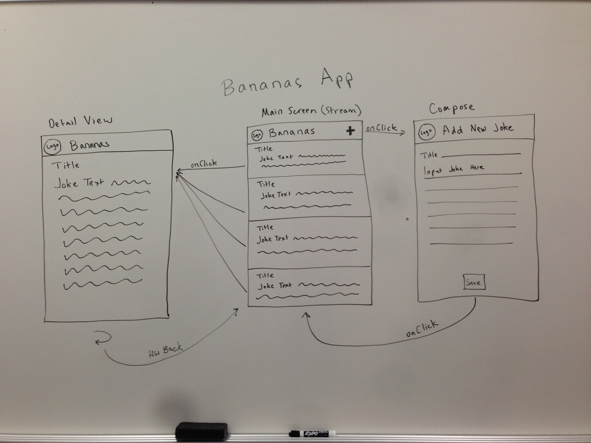

# Bananas
<i>Intro to Android: Group Project</i>

## Team
- Autumn Victor 2
- David Victor
- Gaurav Makhija

## Overview
Jokes app for users to get their daily fix of laughter, engage in a community of jokes, and contribute.

## User Stories
 - User opens the app and sees the latest jokes.
 - User clicks on a joke to read the full joke.
 - User can submit a new text joke.
 - **(Optional)** User can rate up/down jokes
 - **(Optional)** User can Facebook Like jokes so they can share jokes with others that link back to us.
 - **(Optional)** User can Tweet jokes on Twitter with indication of our app.
 - **(Optional)** User can view jokes by greatest (up/down)
 - **(Optional)** User can view jokes by category or setup filters for select categories.
 - **(Optional)** User can view jokes that have images.
 - **(Optional)** User can write jokes with images.
 - **(Optional)** User can view an image-only funny picture stream / category
 - **(Optional)** User up/down votes automatically correlated to category filters.
 - **(Optional)** Company can display ads in the stream that the users can click on.
 - **(Optional)** Company can display banner ads that the user can click on.
 
## Activities
 - Jokes List (by latest, by greatest)
 - Read Full Joke (detail view)
 - Write Joke

## Basic Principles
 - Extremely easy to navigate.
 - User wants to spend a lot of time in the app.

## Wire Frames
 

## Reference
 - [Assignment](https://yahoo.jiveon.com/docs/DOC-3046)
 - [Spring Planning](https://docs.google.com/a/yahoo-inc.com/document/d/1ovSyPseKw6-jMlB-czenkP4n8Nlbl3RjBsO89DFc7ks/edit)
